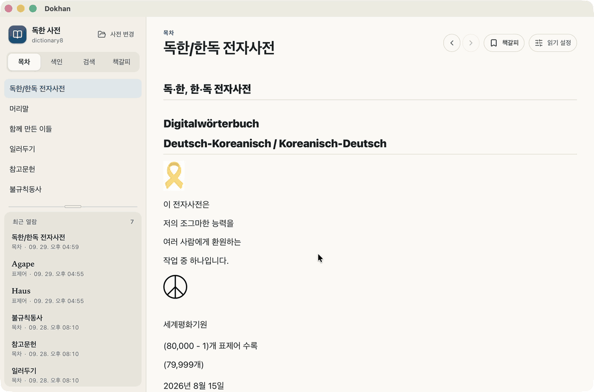

<div align="center">


# 독한 사전 · Dokhan

**찾고, 읽고, 기억하는 독한·한독 전자사전**

이정준 교수의 [german.kr](https://german.kr/) 전자사전을 데스크톱과 Android에서 편하게 읽을 수 있는 앱입니다.<br>
ZIP 파일을 그대로 열어 목차와 색인을 둘러보고, 단어를 검색하고, 책갈피를 남길 수 있습니다.

[](https://github.com/ironpark/dokhan/releases/latest)
[](https://github.com/ironpark/dokhan/actions/workflows/build-targets.yml)
[](#설치)
[](LICENSE)

[**다운로드**](https://github.com/ironpark/dokhan/releases/latest) · [사전 파일 받기](#1-사전-파일-받기) · [사전에 대하여](#사전에-대하여) · [개발](#개발)

</div>

<p align="center">
  
</p>

---

## 시작하기

### 1. 사전 파일 받기

> [!IMPORTANT]
> 앱에는 사전 데이터가 포함되어 있지 않습니다.
> **[german.kr](https://german.kr/)** 상단 메뉴의 **전자사전 → 다운로드**에서 사전 ZIP 파일(예: v8.0의 `dictionary8.zip`)을 먼저 받아 주세요.
> 사전 내용의 저작권은 저자 이정준(german.kr)에게 있습니다.

### 2. 앱 설치

<a id="설치"></a>

[최신 릴리스](https://github.com/ironpark/dokhan/releases/latest)에서 사용하는 기기에 맞는 설치 파일을 받아 주세요.

| 플랫폼 | 파일 | 참고 |
| --- | --- | --- |
| **macOS** (Apple Silicon) | `Dokhan_x.y.z_aarch64.dmg` | 처음 실행할 때 “확인되지 않은 개발자” 경고가 나타나면 **시스템 설정 → 개인정보 보호 및 보안**에서 **그래도 열기**를 눌러 주세요. |
| **Windows** (x64) | `Dokhan_x.y.z_x64-setup.exe` | SmartScreen 경고가 나타나면 **추가 정보 → 실행**을 눌러 주세요. MSI 설치 파일도 제공합니다. |
| **Android** | `app-universal-universal-release.apk` | 브라우저의 **출처를 알 수 없는 앱 설치**를 허용한 뒤 설치해 주세요. |

> [!NOTE]
> **설치할 때 보안 경고가 나타나는 이유**
>
> - **macOS**: 현재 배포본은 Apple Developer ID 인증서로 서명하거나 Apple의 공증을 받지 않아, macOS가 개발자와 앱의 안전성을 확인할 수 없다는 경고를 표시할 수 있습니다. [Apple 안내](https://support.apple.com/ko-kr/102445)
> - **Windows**: 현재 배포본에는 게시자를 확인하는 코드 서명이 없습니다. SmartScreen은 파일의 다운로드·실행 이력 등을 바탕으로 신뢰도를 판단하므로, 충분히 알려지지 않은 앱에는 경고를 표시할 수 있습니다. [Microsoft 안내](https://learn.microsoft.com/en-us/windows/apps/package-and-deploy/smartscreen-reputation)
> - **Android**: Google Play를 거치지 않고 APK 파일을 직접 설치하므로, 파일을 여는 브라우저나 파일 관리자에 **출처를 알 수 없는 앱 설치** 권한이 필요합니다. [Android 안내](https://developer.android.com/distribute/marketing-tools/alternative-distribution)

### 3. 사전 열기

앱을 실행한 뒤 **ZIP 파일 선택**을 눌러 내려받은 사전 파일을 선택해 주세요. 데스크톱에서는 파일을 앱 창에 끌어다 놓아도 됩니다.

**압축을 풀지 않고 ZIP 파일 그대로** 열면 됩니다. 처음 열 때는 검색에 필요한 색인을 만들며, 이후에는 저장된 데이터를 불러와 더 빠르게 열립니다.

## 기능

| 기능 | 설명 |
| --- | --- |
| 🔎 **전문 검색** | 표제어와 뜻풀이 전체에서 검색할 수 있습니다. 움라우트 대신 `ae`·`oe`·`ue`를 입력해도 찾을 수 있습니다. |
| 📚 **목차 · 색인** | 목차와 표제어 색인으로 사전을 둘러볼 수 있습니다. 색인(v8.0 기준 8만여 개)은 스크롤에 맞춰 순차적으로 불러옵니다. |
| 📖 **읽기 설정 · 본문 안내** | 글자 크기, 줄 간격, 본문 폭을 조절할 수 있습니다. 뜻풀이 번호를 보기 좋게 정리하고, 약어와 표기 기호의 의미도 안내합니다. |
| ↔️ **뒤로 · 앞으로** | 본문의 링크로 다른 항목을 열어도 이전 항목의 읽던 위치로 돌아올 수 있습니다. |
| 🔖 **책갈피** | 다시 보고 싶은 표제어와 문서를 책갈피에 저장하고 폴더별로 정리할 수 있습니다. |
| 🔄 **업데이트 알림** | 새 버전이 나오면 알려 줍니다. 데스크톱에서는 앱 안에서 바로 업데이트할 수 있습니다. |

<details>
<summary><b>단축키 (데스크톱)</b></summary>

| 동작 | macOS | Windows |
| --- | --- | --- |
| 뒤로 | `⌘` `[` · 마우스 뒤로 버튼 | `Alt` `←` · 마우스 뒤로 버튼 |
| 앞으로 | `⌘` `]` · 마우스 앞으로 버튼 | `Alt` `→` · 마우스 앞으로 버튼 |

</details>

## 사전에 대하여

이 앱에서 사용하는 독한·한독 전자사전은 성균관대학교 독어독문학과에서 2020년 정년퇴임한 **이정준**(李廷俊) 교수가 만든 사전입니다.
독어독문학계가 쌓아 온 학문적 성과를 바탕으로, 풍부한 어휘와 해설을 담은 전자사전을 빠르게 선보이려는 취지로 시작되었습니다.
버전 4.0까지 성균관대학교 학생들의 도움을 받아 기본 어휘 대부분을 입력했으며, 이후에도 저자가 오류를 바로잡고 내용을 다듬어 오고 있습니다.

> 저의 전자사전이 여러분들께 도움이 된다면 그것으로 저는 기쁘겠습니다.
> 부탁드리건대, 프로그램만 내려받고 떠나지 마시고, 게시판(말씀터)에 글도 남겨주시고, 그곳의 글도 읽고 가세요.
>
> — 이정준

**독한 사전(Dokhan)**은 이 사전 파일을 편하게 읽을 수 있도록 만든 뷰어입니다. 사전 내용의 집필과 수정은 원저자가 맡고 있습니다.

- 사전 내용에 관한 의견이나 오류 제보는 [german.kr](https://german.kr/) 게시판(**말씀터**)에 남겨 주세요.
- 앱 사용 중 발견한 버그나 개선 제안은 [이 저장소의 이슈](https://github.com/ironpark/dokhan/issues)로 알려 주세요.

> [!TIP]
> 본 전자사전은 그 편리함에서 종이사전보다 뛰어나기는 하나, 그 완전함에 있어서는 종이사전을 따라가지 못합니다. 여러분의 곁에 종이사전이 반드시 하나 정도는 놓여있어야 하는 이유입니다.
>
> — 이정준

## 개발

Tauri v2, Svelte 5, TypeScript, Rust로 만들었습니다. CHM/LZX 파서는 순수 Rust로 구현했으며, 전문 검색에는 [Tantivy](https://github.com/quickwit-oss/tantivy)를 사용합니다.

개발 환경에는 Node.js 22.12 이상, pnpm 12, Rust stable이 필요합니다. 의존성을 설치한 뒤 개발 모드로 실행합니다.

```bash
pnpm install
pnpm tauri dev
```

타입 검사와 테스트는 다음 명령으로 실행합니다.

```bash
pnpm check        # 타입 검사
pnpm test         # 프론트엔드 테스트
cargo test --manifest-path src-tauri/Cargo.toml
```

실제 사전 ZIP 파일의 전체 파싱 과정을 확인하려면 파일 경로를 지정해 다음 테스트를 실행합니다.

```bash
DOKHAN_TEST_ZIP=/path/to/dictionary8.zip \
  cargo test --manifest-path src-tauri/Cargo.toml configured_zip_runtime_smoke
```

<details>
<summary><b>구조</b></summary>

- ZIP 파일을 메모리에 불러온 뒤 내부 CHM을 직접 파싱해, 반복적인 파일 시스템 접근을 줄입니다.
- `master.hhc`에서 목차를, `.hhk`에서 색인을 구성합니다.
- 본문의 링크와 이미지 경로(`href` / `src`)를 해석해 CHM 내부의 해당 리소스에 연결합니다.
- 사전 데이터 처리는 백그라운드에서 여러 스레드로 진행하며, 프론트엔드는 진행률을 주기적으로 조회합니다.
- 성능 측정 방법과 결과는 [docs/CHM_BENCH.md](docs/CHM_BENCH.md)에서 확인할 수 있습니다.

</details>

<details>
<summary><b>Tauri 명령</b></summary>

- `prepare_zip_source(path)`
- `start_master_build(zipPath?)`
- `get_master_build_status(zipPath?, buildKey?)`
- `get_master_contents(zipPath?)`
- `get_index_entries(prefix?, limit?, offset?, zipPath?)`
- `search_entries(query, limit?, zipPath?)`
- `get_entry_detail(id, zipPath?)`
- `get_content_page(local, sourcePath?, zipPath?)`
- `resolve_link_target(href, currentSourcePath?, currentLocal?, zipPath?)`
- `resolve_media_data_url(href, currentSourcePath?, currentLocal?, zipPath?)`

</details>

<details>
<summary><b>릴리스</b></summary>

1. `src-tauri/tauri.conf.json`, `package.json`, `src-tauri/Cargo.toml`의 버전을 함께 올립니다.
2. `vX.Y.Z` 태그를 푸시하면 `release.yml`이 앱을 빌드하고 GitHub 릴리스를 생성합니다. 태그의 버전이 앱 버전과 다르면 빌드가 실패합니다.
3. 데스크톱 업데이트 파일은 GitHub Actions Secrets에 등록한 `TAURI_SIGNING_PRIVATE_KEY`와 `TAURI_SIGNING_PRIVATE_KEY_PASSWORD`를 사용해 서명합니다. 앱은 최신 릴리스의 `latest.json`으로 업데이트를 확인합니다.

`main` 브랜치에 푸시하면 `build-targets.yml`이 nightly 프리릴리스를 생성합니다. nightly 버전은 업데이트 알림에 포함되지 않습니다.

앱 아이콘의 원본은 `src-tauri/icons/dokhan-icon.svg`입니다. `pnpm tauri icon src-tauri/icons/icon-manifest.json` 명령으로 플랫폼별 아이콘을 다시 생성할 수 있습니다.

</details>

## 라이선스

앱 소스 코드는 [MPL-2.0](LICENSE)을 따릅니다. 사전 데이터는 이 저장소에 포함되어 있지 않으며, 저작권은 저자 이정준([german.kr](https://german.kr/))에게 있습니다.
